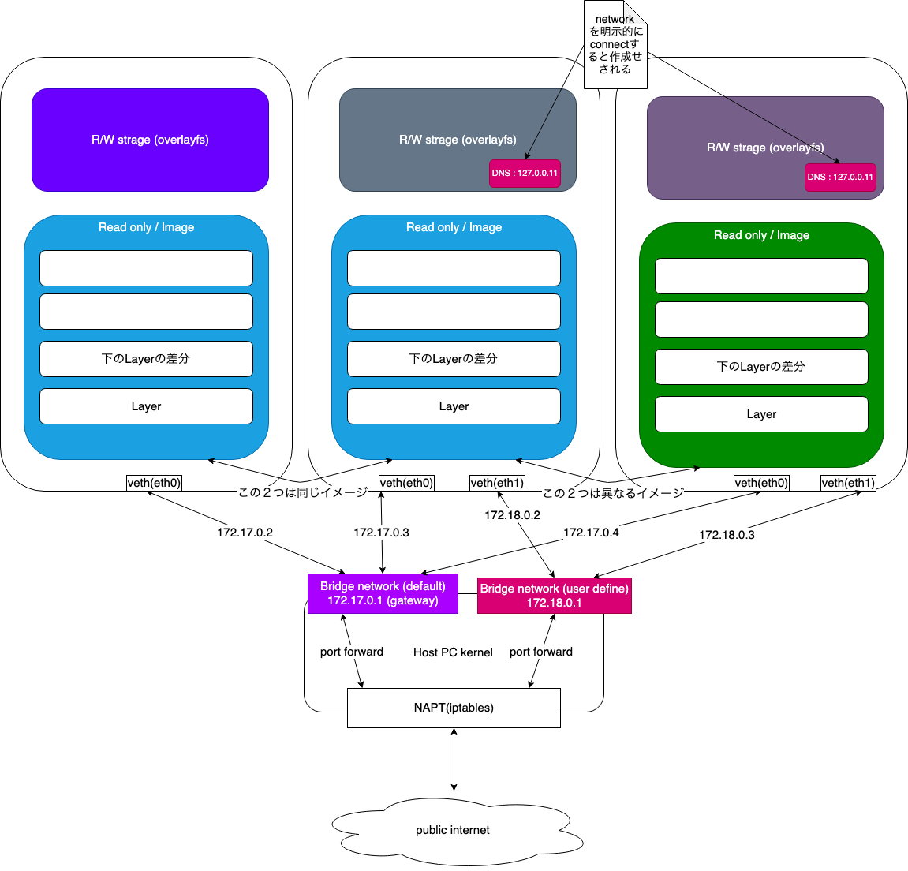

# いろいろなプログラミング環境で使うDockerのコツ

## 第二回目

### 第二回目の目標

注意: linuxのコマンドを前提にしているのでwindowsの方はwindows用のコマンドに置き換えて実行してください

#### 第一回目の振り返り

- Dockerの基本的な概念 docker image, container について
- Docker で最も使うコマンドの復習

[第一回目リンク先](https://github.com/tukkyr/docker-st/blob/master/ch1.md)


```sh
docker info
docker run -it alpine ash
/ # exit
docker run -d --name st debian sleep infinity
docker container inspect st
docker exec -it st bash
docker ps
docker ps -f status=exited
docker images
docker container prune
docker image prune
docker stop st
docker start st
docker rm -f $(docker ps -a -q)
docker rmi -f $(docker images -q)
```

#### Dockerのstrageとvolumeについて

- imageのLayer管理について
- Container 独自のLayerについて

- image type
  - volume
  - bind
  - tempfs

- 実際にデモで
  - volumeを使う
    - コンテナ間のデータの共有
  - bindを使う
  - データのバックアップ

#### Dockerのネットワーク

- ネットワークの確認方法
  - ping コマンド
  - ss コマンド
  - ip コマンド
  - dig コマンド
  - tcpdump

- container間の通信
  - デフォルト network (bridge)
  - user network (type bridge)

#### etcdをマルチコンテナーで構成 or localdynamodb

[etcd](https://etcd.io)

- k8sのdbとして使われている key-value型の分散ストレージ
  - マルチノードで動作する

---

### Dockerのストレージ


imageがLayer構成になっていることは説明したが、
Containerも独自のLayerを持っている

image名:tag名 = layer(ro)のセットに名前をつけている

```sh
docker pull python:latest
docker history python:latest
# python:latestの実態を表示
```

Containerとイメージの差分はdiffで取得できる
(削除も追加も記録される 削除してもimageのサイズは変更されない)

```sh
docker run -it alpine ash
# 以下alpine linuxでの作業
/ # cd
/ # touch test.txt
/ # head -c 1024 /dev/urandom > test2.txt
/ # ctl+p, ctl+q
# 以下host psでの作業
docker diff <container id>

# or
# runを使わずにash(bash)を立ち上げる方法 <こっちの方が好み>
docker run -d alpine sh -c 'while sleep 3600; do :; done'
# debianの場合は docker run -d debian sleep infinity でOK
#<container id>
docker exec -it <container id> ash
/ # ps -ef で sleep と ash が起動していることを確認
```

```sh
docker ps -s
# size: R/W layer で利用した size
# virtual size: imase + R/W layer
# CONTAINER ID        IMAGE               COMMAND             CREATED             STATUS              PORTS               NAMES               SIZE
# 606d3c712c48        alpine              "ash"               5 minutes ago       Up 5 minutes                            pensive_ride        1.42MB (virtual 7MB)
```

実装はlnux kernel1の`overlayfs`で実現されている

```sh
docker info
```

※[実際はLinux distributionによって異なる](https://docs.docker.com/storage/storagedriver/select-storage-driver/)

```sh
sudo ls /var/lib/docker/containers
sudo du -sh /var/lib/docker/containers/*
```

> docker for macの人は vm上に作成されているため 直接 /var/lib/docker 以下を見ることができない
>
> `screen ~/Library/Containers/com.docker.docker/Data/vms/0/tty` で vmのttyにアタッチすることで確認可能 (ctl+a,dでデタッチ可能)
> docker for windows の方は hyper-vのvmにアクセスする必要があるのですが、windows pcで作業確認時間がなく未確認です　すいません

containerのlayerはcontainer毎にことなるため、変化内容をcontainer間で共有することが
できない、そこで volume が登場する

### Dockerのvolume


Dockerのvolumeではよく使われるものが3種類ある

- 永続化可能
  - volume: docker専用領域を使う デフォルトでは /var/lib/docker/volume/XX/_data
  - bind: host pcのfilesystemの領域をそのまま containerでも利用する
- 永続化不可能
  - tempfs: memory上に一時的に領域を確保する

> docker for macの人は vm上に作成されているため 直接 /var/lib/docker 以下を見ることができない
>
> `screen ~/Library/Containers/com.docker.docker/Data/vms/0/tty` で vmのttyにアタッチすることで確認可能


-v (--volume) と --mount のオプションがあり
Docker 17.06 から --mount オプションを使うことを推奨されている
ただしこちらは削除予定はなく`should`レベルにとどまっている

 > New users should try --mount syntax which is simpler than --volume syntax.

本イベントでは`--mount`を使う

- The type of the mount, which can be `bind`, `volume`, or `tmpfs`. This topic discusses volumes, so the type is always `volume`.
- The source of the mount. For named volumes, this is the name of the volume. For anonymous volumes, this field is omitted. May be specified as `source` or `src`.
- The destination takes as its value the path where the file or directory is mounted in the container. May be specified as `destination`, `dst`, or `target`.
- The readonly option, if present, causes the bind mount to be mounted into the container as `read-only`.
The volume-opt option, which can be specified more than once, takes a key-value pair consisting of the option name and its value.

英語で書かれているが、要するに type(マウントタイプ)とsource(マウント元)とdestination(マウント先)を決めて、
read-onlyにするかどうか選ぶこと

`--mount type=volume,src=vol,dst=/app`のように使う

#### volumeを作成する(type volume)

```sh
docker volume create vol
docker volume inspect vol
# 存在しないvolumeを指定すると 自動的に新しいvolumeが作成される
docker run -d --name devtest --mount src=vol2,dst=/app nginx:latest
# docker run -d --name devtest -v myvol2:/app nginx:latest
docker run -d --name nonametest --mount dst=/app nginx:latest
# 名前を指定しないと 適当なハッシュ値でvolumeを作成する
docker volume ls
```

#### volume mount 共有

```sh
docker run -d --mount src=vol,dst=/app alpine touch /app/test.txt
docker ps -a
docker run -it --mount src=vol,dst=/app alpine ash
# 後片付け
docker volume prune
docker rm -f $(docker ps -a -f)
```

#### bind

```sh
docker run -it --name devtest --mount type=bind,source="$(pwd)"/target,target=/app alpine ash
# docker run -d -it --name devtest -v "$(pwd)"/target:/app nginx:latest
# macのかたは Docker for mac でfileシェアを有効にしておく必要がある
# windows のかたは c:/<path> のように指定する Docker for windows で fileシェアを有効にしておくひつようが有る
```

#### Backup (時間が余った方は)

dockerの領域は直接Accessできないためtype volumeとbindを使ってcontainerを介して行う

```sh
# backup a container
docker run --mount dst=/dbdata --name dbstore ubuntu /bin/bash
docker run --rm --volumes-from dbstore --mount type=bind,src=$(pwd),dst=/backup ubuntu tar cvf /backup/backup.tar /dbdata
# --volumes-from は 指定した containerの volue設定をそのまま受け継ぐ
```

```sh
# restore container from backup
docker run --mount dst=/dbdata --name dbstore2 ubuntu /bin/bash
docker rundocker run --rm --volumes-from dbstore2 --mount type=bind,src=$(pwd),dst=/backup ubuntu bash -c "cd /dbdata && tar xvf /backup/backup.tar --strip 1"
```

---

### Dockerのネットワークについて

ipv4のネットワークとvethによる仮想L2スイッチ, brctlによる仮想L３スイッチが内部で使われているため
ネットワークのL2,L3に詳しくないとついていくのは厳しいかも

内容が理解できなかった方はcontainer間の通信方法注目していただけると助かります



上の図のようにBridge networkを利用して通信を行う
実際の実装は kernel namespace と veth(L2トンネリング) と brctl(L3スイッチ) により実現

--linkと環境変数をつかったやり方は将来削除予定のため今回は説明の対象外　詳しくは[こちら](https://docs.docker.com/network/links/)

> Warning: The --link flag is a legacy feature of Docker. It may eventually be removed. Unless you absolutely need to continue using it, we recommend that you use user-defined networks to facilitate communication between two containers instead of using --link.

#### ネットワーク調査用のツール

- ping: 疎通確認
- ss: tcp, udp port, linux scket の状態確認
  - `ss -nplt`: は LISTEN portを見るのによく使う
- ip: ネットワーク の設定確認
  - `ip link show`, `ip addr show`
  - `ip -f inet -o addr show eth0 | awk '{print $4}' | cut -d/ -f 1`: eth0のipaddrを抜き出す
  - `ip route show local`: ローカルのroute tableの表示
  - `ip route show main`: 外部との通信を行う際のtableを表示
- dig: DNS のリクエスト情報の確認 (`apt install dnsutils`でインストール)
  - dig www.google.com: google DNS サーバーへの DNS呼び出しをトレースする
  - nslookupでもOK
- tcpdump: 今回は時間の都合上省略する tpcのパケットを調査するときに使う
- ps: Processを確認するのに利用 (`apt install procps`でインストール)

#### 公式のチュートリアルにトライしよう

[リンク先](https://docs.docker.com/network/network-tutorial-standalone/)

> 公式チュートリアルでは alpine linux を使っていますが、より細かい情報を取得するために
> debian linuxを本イベントで利用します。

##### User-Dridge

```sh
docker run -dit --name co1 --network net debian bash
docker run -dit --name co2 --network net debian bash
docker run -dit --name co3 debian bash
docker run -dit --name co4 --network net debian bash
docker network connect bridge co4 # bridgeをco4にアタッチ
```

サブネット知識が必要になる

- ipaddr : 自分に振られているIPアドレス
- subnet mask: network部とhost部に分ける 172.17.0.2/16のような表記になっていることが多い (CIDR)
  - 上記の例だと11111111111111110000000000000000のようなマスクをipaddrに適応することで 172.17.0.0というnetworkアドレスを取得する
- gateway: 別のネットワーク部にpopするためのアドレス 172.17.0.1 今回は brctlによって内部にL3仮想スイッチが作られている

- 同じnetworkに属する host同士 直接通信が可能
- 異なるnetworkに属する host同士 gatewayを通して通信可能 napt(out方向), portmapping,portforward(in方向) (brctl, iptableによって実現)

```sh
docker container ls -f name=co
docker network inspect bridge
docker network inspect net

# どこかにメモしておく
# Subnetが 172.17.0.0 と 172.18.0.0 でネットワークが分離されている
```

```sh
docker container attach co1
# ip -f inet -o addr show で eth0の状態を確認
/ # apt update
/ # apt install -y dnsutils
/ # ping -c 2 co2
/ # ping -c 2 co4
/ # ping -c 2 co3
# 同じネットワーク上にいないので見つからない `docker network inspect net`
/ # cat /etc/resolv.conf
/ # dig co2
```

```sh
docker container attach co4
/ # ping -c 2 co1
/ # ping -c 3 co3
# bad address 'co3'
/ # ping -c 172.17.0.2 #co3 のipaddressを直接指定
```

以上のことより dockerのcontainer間で通信するには

host名に 対象の名前を指定して すれば良い

細くネットワーク設定がどうなっているか調べる

```sh
ip link show
docker container attach co4
/ # ip link show
/ # apt update
/ # apt install dnsutils
/ # dig co1 A
/ # cat /etc/resolv.conf
# 127.0.0.11 に向いているはず
docker container attach co3
/ # cat /etc/resolv.conf
# host pc と同じ DNS server に向いているはず
```

後片付け

```sh
docker rm -f co1 co2 co3 co4
docker network rm net
```

応用編 NAPTの設定を確認する

```sh
sudo bridge-utils
brctl show
docker network create test-net
docker run -it --net test-net alpine sleep infinity
docker run -it --name napt --net test-net debian bash
/ apt update
/ apt install dnsutils
/ ip link show eth0
# veth のペアを調べる
# デタッチ
ip link show
# veth のベアを調べる
brctl show
sudo iptables --table nat --list
ip route show table local
ip route get 8.8.8.8
docker attach napt
/ ip route get 8.8.8.8
# 172.17.0.0から来たパケットはallに渡される hostで `ip route get 8.8.8.8`したときと同じRouteを通る
/ ip route show table main
/ ip route show table local
```

#### host pcからcontainer内にアクセスする

portmappingを使う, docker runの実行時に指定する

run以外のタイミングでは指定できない

```sh
docker run -it --name py-server1 -p 8080:8080 python:3 bash
# / mkdir /app
# / cd /app
# / cat /etc/hostname > index.html
# / ip addr
# / python -m http.server 8080
# デタッチして
sudo iptables --table nat --list
# portforwordingを確認
sudo ss -lnpt
# *:8080でlistenされていることを確認

# ブラウザからアクセス localhost:8080
docker run -it --name py-server2 --expose 8081 -P python:3 bash
# / python -m http.server 8081
# デタッチして
sudo ss -lnpt
```

run時に -p オプションを指定することで hostpcからcontainerにアクセスできる

[networkアーキテクチャで参考になりやすそうなサイト](https://success.docker.com/article/networking)

---

### Docker内部からhostPCにアクセスする

#### hostPCがlinuxの場合

```sh
ip -f inet -o addr show docker0
# docker0 gateway の broadcastアドレスを調べる
ip -f inet -o addr
# host pc の docker0 の転送先のipを調べる
docker run -i alpine ping -c 2 < host ip >
# 疎通確認をする
```

#### hostPCがdocker for mac (or windows)の場合

vm上で Docker Demonが立ち上がっているため osのip を調べてもたどり着かない

公式ページに解決方法が記載されている (host.docker.internal) を利用する

```sh
docker run -i alpine ping -c 2 host.docker.internal
```

[for mac](https://docs.docker.com/docker-for-mac/networking/)

[for windows](https://docs.docker.com/docker-for-windows/networking/)

##### ホストネットワーク

localhostでお互いと通信することができる

hostのnetifをそのまま利用している

eh0もdocker0のnetifもそのまま利用できる

[リンク先](https://docs.docker.com/network/network-tutorial-host/)

### etcdを使う

T.B.D

> Enable synchronize-panes: ctrl+b then shift :. Then type set synchronize-panes on at the prompt. To disable synchronization: set synchronize-panes off.

```sh
docker network create etcd-net
tmux
docker run -it --name srv1 --net etcd-net debian bash
#eh0のuser bridgeのip address取得
ip -f inet -o addr show eth0 | awk '{print $4}' | cut -d/ -f 1
export ETCD_IP_ADDR=$(!!)
wget https://github.com/etcd-io/etcd/releases/download/v3.4.0-rc.2/etcd-v3.4.0-rc.2-linux-amd64.tar.gz
tar xvfz etcd-v3.4.0-rc.2-linux-amd64.tar.gz
cd etcd-v3.4.0-rc.2-linux-amd64/bin
./etcd --name ${HOSTNAME} --listen-peer-urls http://${ETCD_IP_ADDR} --initial-advertise-peer-urls http://${ETCD_IP_ADDR} --initial-cluster srv1=http://172.18.0.2:2380,srv2=http://172.18.0.3:2380 &
./etcdctl member list
# 片方のcontainerで
./etcdctl set /foo bar
./etcdctl get /foo
./etcdctl ls
# などを実行
```

### 補足

#### Docker の logging

[loging](https://docs.docker.com/config/containers/logging/configu)

#### Docker の セキュリティー

```sh
--cap-add=SYS_PTRACE --security-opt seccomp=unconfined
```
