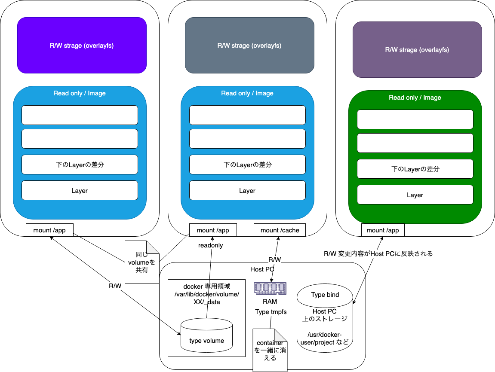
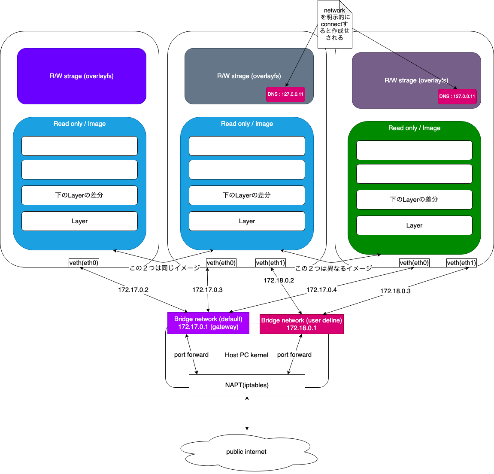

# 色々なプログラミング環境で使うDockerのコツ

Final

docker swarm は対象にしていません

## 復習

### dockerの基本構成


> RegistryとRepositoryの違い
> - Registry: dockerhub, ECR, GCP Container Registry などのimage置き場そのもの
> - Repository: Registryに置かれる　同じimage名で異なるtagを持つイメージのセット置き場

imageはReadOnlyなlayerを持っている


同じイメージは使いまわし < cacheが効く >

Containerも**Writableな**独自のLayerを持っている

> だたし、他のContainerとは独立している

### 基本コマンド
```sh
docker info
docker pull debian
docker run -it alpine ash
/ # exit
docker run -d --name st debian sleep infinity
docker container inspect st
docker exec -it st bash
docker ps
docker ps -f status=exited
docker images
docker container prune
docker image prune
docker stop st
docker start st
docker rm -f $(docker ps -a -q)
docker rmi -f $(docker images -q)
# New : 使われていない(＝containerの状態がUPでない)すべてのリソースを削除
docker system prune -a
docker volume prune
```


### docker volume

他のContainerやhostpsとデータを共有するするために使用、データの永続化のために作成




```sh
docker volume create ssh
# container作成時にattach(mount)する
docker run -d --name ssh --mount src=ssh,dst=/root/.ssh debian sleep infinity
docker exec -it ssh bash
```

> windowのhostpsとfile共有するとパーミッションが755になるので注意

### docker network

> コンテナ間の通知のやり取り



```sh
docker network create backend
docker run -d --name db --network backend debian sleep infinity
# networkを明示的に指定することで dockerが提供するDNSを使えるようになる
# default bridge は container名ではやり取りできない IPアドレスを直接指定することは可能
docker run -it --rm --network debian bash
$ ping db -c 3
```

### docker file

- remote registory から pull したイメージに独立したlayerを追加して新たなイメージを作成する設計図となる

- Environment variables 
  - FROM
  - COPY
  - RUN
  - ENV : containerの動作後に使う環境変数
  - ARG : build時に使う環境変数
  - CMD

> shellの環境変数はbuild時に利用できない

```dockerfile
FROM debian
RUN set -x \
 && apt-get update \
 && apt-get install -y git vim
 && rm -rf /var/lib/apt/list/*

ARG VIMRC_VERSION

COPY ./vimrc_${VIMRC_VERSION} /root/.vimrc
```

apt-getを使うのはaptではshをサポートしてないため警告が表示されるため

```sh
export VIMRC_VERSION=0.2.0
docker build --build-arg 'VIMRC_VERSION=0.1.0' -t t:1 .
# contextがDockerfileのある場所とこの異なる場合
# docker build --build-arg 'VIMRC_VERSION=0.1.0' -t t:2 -f Dockerfile-Alt ./context
docker run -it t:1 bash
```

### docker-compose とは

#### できること

- 上記で説明したDokcer container間の連携を宣言的に記述できる
- 一つのhostに独立した環境を作成することができる
  - `-p` or COMPOSE_PROJECT_NAMEを使うことでproject名を明示的に指定できる, 指定しないとディレクトリ名
- データを引き継いだまま updateできる
  - docker-compose up ( imageを更新する場合は --build フラグをつける )
- multiple compose file [override](https://docs.docker.com/compose/extends/)

#### 使われ方

- 開発環境
- 自動テスト環境
- single host deployments

### docker-composeのインストール

> docker for mac (or windows)の方はデフォルトでインストール済み

linux

```sh
sudo curl -L "https://github.com/docker/compose/releases/download/1.24.1/docker-compose-$(uname -s)-$(uname -m)" -o /usr/local/bin/docker-compose

sudo chmod +x /usr/local/bin/docker-compose

# Alternative install options

pip install docker-compose
```

### docker-composeのための3ステップ

- サービス(app)の実装
- Dockerfileの定義
- docker-compose.ymlの定義
- `docker-compose up` によるアプリの起動

### 実際の使用例

[Docker Engine](https://docs.docker.com/install/) と [Docker Compose](https://docs.docker.com/compose/install/) があればOK

#### python + redis

FLASKとRedisを使ってアクセスカウンタを作成する

プロジェクトについて
名前空間を分ける `docker-compose -p`オプションで指定, 指定しないとディレクトリ名でプロジェクトが作成される

- サービス(app)の実装

app.py

```python
import time

import redis
from flask import Flask

app = Flask(__name__)
cache = redis.Redis(host='redis', port=6379)


def get_hit_count():
    retries = 5
    while True:
        try:
            return cache.incr('hits')
        except redis.exceptions.ConnectionError as exc:
            if retries == 0:
                raise exc
            retries -= 1
            time.sleep(0.5)


@app.route('/')
def hello():
    count = get_hit_count()
    return 'Hello World! I have been seen {} times.\n'.format(count)
```
requirements.txt

```txt
flask
redis
```

FLASKのdefault portは5000

Dockerfile

```docker
FROM python:3.7-alpine
WORKDIR /code
ENV FLASK_APP app.py
ENV FLASK_RUN_HOST 0.0.0.0
RUN apk add --no-cache gcc musl-dev linux-headers bash
COPY requirements.txt requirements.txt
RUN pip install -r requirements.txt
COPY . .
CMD ["flask", "run"]
```
docker-compose

```yaml
version: '3.7'
services:
  web:
    build: .
    ports:
      - "5000:5000"
  redis:
    image: "redis:alpine"
```

Build and run

```sh
# build コンテキストの変更が反映されないので --build オプションをつけたほうが無難 cacheは効く
$ docker-compose up --build

# 立ち上がったサービスには docker-compose exec でプロセスを立ち上げることができる
# docker-compose execはデフォルトでTTYを確保する
# コンテナ名ではなくサービス名を入れることに注意
$ docker-compose exec web bash

# cmdを上書きし 別のcontainerを立ち上げる
$ docker-compose run web bash
```

Re-build

docker-compose fileを編集する

```yaml
version: '3.7'
services:
  web:
    build: .
    ports:
      - "5000:5000"
    volumes:
      - .:/code
    environment:
      FLASK_ENV: development
  redis:
    image: "redis:alpine"
```

> FLASK_ENV=development は appが変化した場合Flask ServerをReloadし直す

```sh
docker-compose up
docker-compose down
# 指定したserviceのcontainerを立ち上げる ※depends_onに指定されているサービスも立ち上げる
docker-run 
docker-compose stop
# 無名volumeを一緒に削除 redisは無名volumeをdockerfileの中で作成するのでそのvolumeを削除
# docker compose file内で定義した volume も削除する
# docker-compose down --volumes
```

> docker-composeを使うときは、コンテキストに位置に注意する docker-composeがdocker-compose.ymlを見つけれないと実行できない

### Multiple Compose files

デフォルトでは docker-compose.ymlとdocker-compose.override.yml

docker-compse -f 1 -f 2 で1をベースに2を上書きできる

### 環境変数

docker-composeならhostpcのshellの環境変数をそのまま利用することができる
docker-compose.yamlと同じディレクトリに置かれた`.env` fileがデフォルトの環境変数ファイルとなる

> Dockerfileは直接 shellの環境変数を扱うことができない

> ```yaml
> version: '3.7'
> services:
>   web:
>     build:
>       context: .
>       args:
>         buildarg: 1
>         #or - buildarg=1 リストでも指定可能
>     ports:
>       - "5000:5000"
>     volumes:
>       - .:/code
>     environment:
>       FLASK_ENV: development
>   redis:
>     image: "redis:alpine"
> ```

環境変数の優先順位

1. Compose file
1. Shell environment variables
1. Environment file (.env)
1. Dockerfile (ENV)
1. Variable is not defined

api.env

```txt
COMPOSE_ENV=test
```

docker-compose.yaml

```yaml
version: '3'
services:
  api:
    image: 'debian:3'
    env_file:
      - ./api.env
    environment:
      - COMPOSE_ENV=production
    command:
      - sleep
      - infinity
```

```sh
export COMPOSE_ENV=shell
docker-compose up
docker-compose exec api bash
$ env | grep COMPOSE_ENV
```

### network aliases

```yaml
version: "3.7"

services:
  web:
    image: "nginx:alpine"
    networks:
      - new

  worker:
    image: "my-worker-image:latest"
    networks:
      - legacy

  db:
    image: mysql
    networks:
      new:
        aliases:
          - database
          # newのnetworkでは db or databeseとして公開される
      legacy:
        aliases:
          - mysql
          # legacyのnetworkでは db or mysqlとして公開される

networks:
  new:
  legacy:
```

### VSCode Remote Container Debug

[VSCode Extention](https://code.visualstudio.com/docs/remote/containers)

```sh
git clone https://github.com/Microsoft/vscode-remote-try-python
```

#### 要素の説明

- `.devcontainer`
  - Dockerfile
  - docker-compose.yaml
  - devcontainer.json : vscode用の設定ファイル
- `.vscode`
  - launch.json : debug時に実行する環境の定義
  - task.json : debug実行時に実行するコマンド定義 lauch.jsonから参照される

### Dind

docker in docker のデモ dockerの中でdocker containerを作成できるから便利

docker-compose.yaml

```yaml
version: '3.7'
services:
  dind:
    image: docker:dind
    networks:
      - dind-net
    environment:
      DOCKER_TLS_CERTDIR:
    privileged: true
  
  python3:
    build:
      context: .
      target: python3-dev 
    networks:
      - dind-net
    volumes:
      - app-data=/app
    environment: 
      DOCKER_TLS_CERTDIR:
      DOCKER_HOST: tcp://dind:2375
    command: 'sh -c "while sleep 3600; do :; done"'
  
    init: true

networks:
  dind-net:

volumes:
  app-data:
```

Dockerfile

```dockerfile
FROM docker:stable AS base-stage 

# RUN addgroup -S -g 1000 tukky && adduser -S -G tukky -u 999 tukky

RUN apk add --no-cache bash tzdata curl wget vim git sudo shadow \
 && cp /usr/share/zoneinfo/Asia/Tokyo /etc/localtime \
 && apk del tzdata

# USER tukky

RUN wget https://raw.githubusercontent.com/git/git/master/contrib/completion/git-prompt.sh -O ${HOME}/.git-prompt.sh \
 && mkdir -p ${HOME}/.vim/autoload && wget https://raw.githubusercontent.com/junegunn/vim-plug/master/plug.vim -O ${HOME}/.vim/autoload/plug.vim \
 && echo . ${HOME}/.git-prompt.sh >> ${HOME}/.bashrc \
 && echo "PS1='\[\e[36m\]\h\[\e[m\] \[\e[32m\]\W\[\e[m\] <\t> \$(__git_ps1 \"( %s ) \") \$ '" >> ${HOME}/.bashrc

RUN [ -z ${http_proxy} ] || echo export http_proxy=${http_proxy} >> ${HOME}/.bashrc

RUN echo -e "set nocompatible\n\
filetype off\n\n\
call plug#begin('~/.vim/plugged')\n\n\
Plug 'VundleVim/Vundle.vim'\n\n\
call plug#end()\n\
filetype plugin indent on\n\
syntax enable \n\n\
set st=4 ts=4 sw=4" | tee  ${HOME}/.vimrc

CMD ["sh", "-c", "while sleep 3600; do :; done"]

FROM base-stage AS python3-dev

WORKDIR /venv

RUN apk add --no-cache python3 python-dev gcc g++ gfortran openblas-dev linux-headers\
 && python3 -m venv .venv \
 && . .venv/bin/activate \
 && pip install -U pip setuptools \
 && pip install python-language-server flake8 \
 && echo . /venv/.venv/bin/activate >> ${HOME}/.bashrc

WORKDIR /app

CMD ["bash"]
```

```sh
docker-compose up -d --build
docker-compose exec python3 bash
docker-compose run python3
docker-compose down --volume

### リファレンス

ビルドコンテキスト内で飲み有効なコマンドとdocker-compose全体に対するコマンドを区別する

- version
- < service name >
- build
  - context
  - dockerfile
  - args: docker build --build-argと同じ obj or list で指定
  - cache_from : ci のとき有効
  - shm_size
  - target : multi stage buildのtarget指定
- image
  - 単体で使うと registoryからimageのダウンロード
  - buildとあわせるとimage名の指定
- cap_add,cap_drop
- init: init プロセスから起動されるようになる (docker-init) version 3.7 以降
  - 子プロセスのゾンビ化を防ぐ
- command
- depends_on
- devices
- entrypoint
- env_file
- environment
- expose
- logging
- networks: short format, long format
  - aliasesとの組み合わせが強力
- ports
- restart: no, always, on-failure, unless-stopped
- volumes: short format, long format
- name

